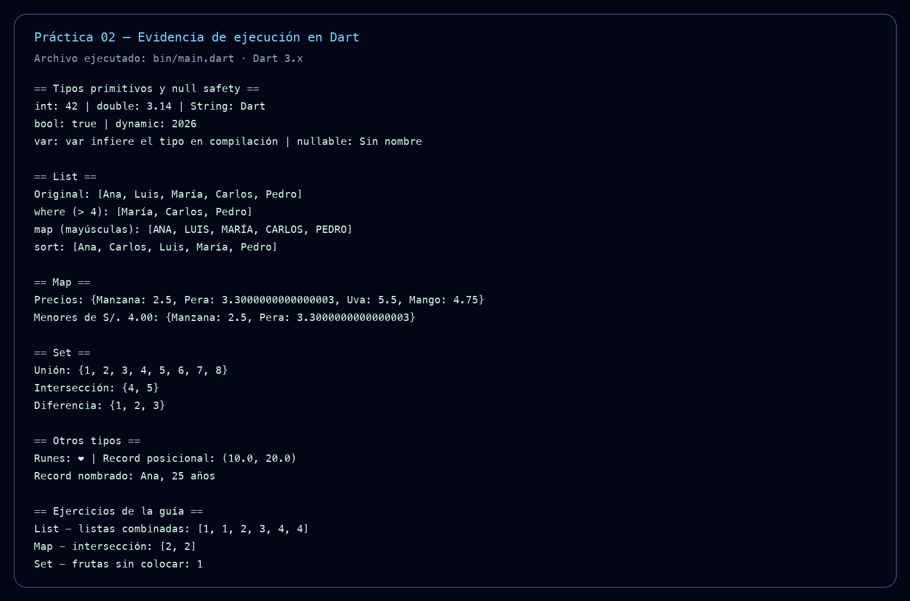

# Informe — Práctica 02 de Dart

## 1. Objetivo

Resolver los ejercicios de la guía sobre `List`, `Map` y `Set`, demostrando
además el uso de tipos primitivos, null safety, records y Unicode (`Runes`).

## 2. Soluciones

### Ejercicio 1 — List

`mergeSortedLists` combina dos listas enlazadas ordenadas usando un nodo
sentinela. Reutiliza los nodos existentes y avanza siempre el nodo con menor
valor. Complejidad: **O(n + m)** en tiempo y **O(1)** en espacio adicional.

### Ejercicio 2 — Map

`intersectWithMultiplicity` cuenta las apariciones de `nums1` en un
`Map<int, int>` y consume una aparición cada vez que encuentra el valor en
`nums2`. Complejidad: **O(n + m)** en tiempo y **O(k)** en espacio, donde `k` es
la cantidad de valores distintos.

### Ejercicio 3 — Set

`countUnplacedFruitTypes` recorre las frutas de izquierda a derecha y usa un
`Set<int>` para marcar los índices de las cestas ocupadas. Para cada fruta
elige la primera cesta disponible cuya capacidad sea suficiente. Complejidad:
**O(n²)** y **O(n)** de espacio adicional.

## 3. Verificación

Comandos ejecutados:

```bash
dart analyze
dart run test/guide02_test.dart
dart run bin/main.dart
```

Resultado: análisis sin problemas y todas las pruebas de los ejemplos de la
guía aprobadas.

## 4. Captura de respaldo

La captura muestra la salida reproducible de la ejecución de `bin/main.dart`:



## 5. Enlaces de entrega

- Repositorio GitHub: **pendiente de publicación/autenticación de GitHub**.
- DartPad: **pendiente de publicar el Gist asociado**.

El código fuente que debe copiarse en DartPad está en
[`../bin/main.dart`](../bin/main.dart).
